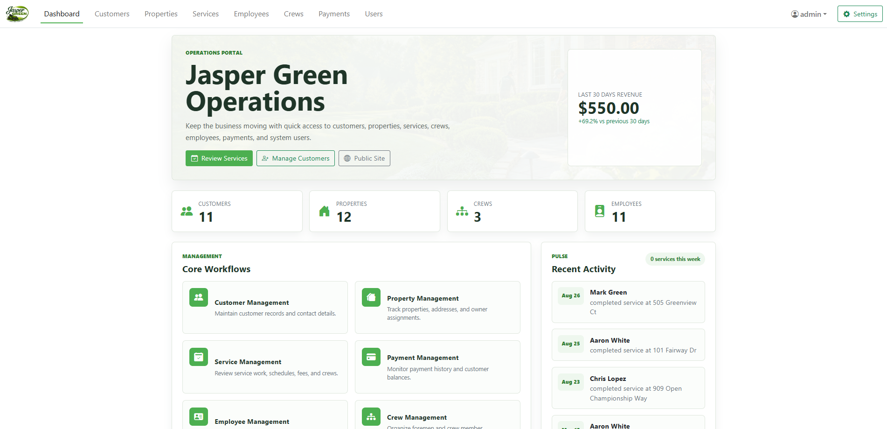

<a id="readme-top"></a>

<!-- PROJECT HEADER -->
<div align="center">

# Jasper Green Operations

### Full-stack business operations platform built with ASP.NET Core MVC, C#, SQL Server, and Entity Framework Core

[![C#][csharp-shield]][csharp-url]
[![.NET][dotnet-shield]][dotnet-url]
[![ASP.NET Core][aspnet-shield]][aspnet-url]
[![SQL Server][sqlserver-shield]][sqlserver-url]
[![Bootstrap][bootstrap-shield]][bootstrap-url]
[![LinkedIn][linkedin-shield]][linkedin-url]

<br />

Jasper Green Operations is a full-stack information system built around the day-to-day operations of a fictional landscaping company. The application combines a public-facing website with an authenticated internal portal used to manage customers, properties, employees, crews, services, payments, invoices, and system users.

[View Repository](https://github.com/colebh03/jasper-green-operations)
·
[LinkedIn](https://www.linkedin.com/in/cole-howell/)

</div>



---

<!-- TABLE OF CONTENTS -->
<details>
  <summary><strong>Table of Contents</strong></summary>
  <ol>
    <li>
      <a href="#about-the-project">About the Project</a>
      <ul>
        <li><a href="#business-workflow">Business Workflow</a></li>
        <li><a href="#built-with">Built With</a></li>
      </ul>
    </li>
    <li>
      <a href="#core-features">Core Features</a>
      <ul>
        <li><a href="#operations-portal">Operations Portal</a></li>
        <li><a href="#business-rules-and-validation">Business Rules and Validation</a></li>
        <li><a href="#filtering-and-data-access">Filtering and Data Access</a></li>
        <li><a href="#dashboard">Dashboard</a></li>
        <li><a href="#invoice-generation">Invoice Generation</a></li>
        <li><a href="#public-website">Public Website</a></li>
      </ul>
    </li>
    <li><a href="#architecture">Architecture</a></li>
    <li><a href="#getting-started">Getting Started</a></li>
    <li><a href="#project-background">Project Background</a></li>
    <li><a href="#what-i-took-from-the-project">What I Took From the Project</a></li>
    <li><a href="#contact">Contact</a></li>
  </ol>
</details>

---

<!-- ABOUT THE PROJECT -->
## About the Project

Jasper Green Operations is a system I independently designed and developed to model the operational needs of a fictional landscaping company.

The main problem behind the project was that the company needed one system capable of connecting information that would otherwise exist across separate records and processes. Customer information affects property information, properties affect service pricing, employees are organized into crews, crews complete services, and completed services ultimately connect to payments and invoices.

Because of this, the project was built around the business process first rather than around a collection of independent CRUD pages.

The application includes two main components:

- A public-facing company website for customers
- An authenticated internal operations portal for managing day-to-day business activity

### Business Workflow

The system is organized around a connected set of business relationships:

**Customer → Property → Service → Crew → Payment → Invoice**

A customer can own multiple properties, and each property stores its own contracted service fee. Employees are assigned to crews, with each crew consisting of a foreman and two additional members. Service records connect a customer, property, crew, date, and service fee, while payments are recorded against completed services and can then be used to generate customer invoices.

The goal of this structure was to make the application behave like a connected business system rather than treating each database entity as an isolated record.

<p align="right">(<a href="#readme-top">back to top</a>)</p>

---

### Built With

#### Application

- C#
- .NET 8
- ASP.NET Core MVC
- Razor
- ASP.NET Core Identity

#### Data

- SQL Server LocalDB
- Entity Framework Core
- Code First migrations
- LINQ

#### Front End

- HTML
- CSS
- JavaScript
- Bootstrap
- Bootstrap Icons

#### Integration and Development

- PdfMyHtml API
- `HttpClient`
- JSON request and response handling
- Visual Studio
- Git
- GitHub

<p align="right">(<a href="#readme-top">back to top</a>)</p>

---

<!-- CORE FEATURES -->
## Core Features

### Operations Portal

The authenticated operations portal gives an administrator one place to work across the company's main operational areas.

The portal includes:

- Customer and property management
- Employee and crew management
- Service scheduling and tracking
- Payment history and customer balances
- System-user administration
- Password management
- Operational dashboard and recent activity

The purpose of the portal is to keep these workflows connected so that information entered in one area can support later parts of the process.

### Business Rules and Validation

A major part of the project was deciding which rules should be enforced by the system rather than relying only on the user to enter valid information.

Examples include:

- A property must belong to a valid customer
- A crew must contain three different employees
- A service fee cannot be entered below the property's standard service rate
- Finalized services with recorded payments cannot be edited
- Records referenced by dependent data are protected from invalid deletion
- Property selections dynamically update based on the selected customer
- Forms provide validation and user feedback for completed or blocked operations

These rules help preserve the relationships between records and prevent changes that would leave the database in an invalid or inconsistent state.

### Filtering and Data Access

The application includes filtering and sorting across several operational lists so users can find relevant records without manually searching through the entire dataset.

Examples include:

- Service filtering by customer, property, or crew
- Payment filtering by customer and date
- Multi-column sorting across operational lists
- Entity Framework Core relationship loading for connected business data
- LINQ queries that apply filtering and sorting before results are returned to the view

### Dashboard

The administrative dashboard was built to give a quick summary of the current state of the business rather than requiring an administrator to open several separate pages.

It displays:

- Total customers
- Total properties
- Total crews
- Total employees
- Service activity from the previous seven days
- Revenue from the previous 30 days
- Revenue comparison against the preceding 30-day period
- Recent completed service activity

### Invoice Generation

One of the larger additions to the original project was automated PDF invoice generation.

When an invoice is requested, the application:

1. Retrieves the related customer, property, crew, service, and payment data
2. Renders the Razor invoice view into HTML
3. Sends the rendered HTML to the PdfMyHtml API
4. Polls the external conversion job until processing completes
5. Downloads and returns the generated PDF to the user

This feature required connecting application data, Razor rendering, JSON serialization, an external API, asynchronous HTTP requests, and file generation into one workflow.

The API credential is stored outside version control through local development configuration.

### Public Website

The project also includes a separate public-facing website for the fictional Jasper Green company.

It includes:

- Home, About, and Contact pages
- Residential and commercial service information
- Responsive layouts and navigation
- Custom CSS and Bootstrap styling
- Scroll-based interface effects
- Separate public and administrative layouts within the MVC application

The public site was designed separately from the internal portal so the customer-facing experience could have its own structure and visual identity while still remaining part of the same application.

<p align="right">(<a href="#readme-top">back to top</a>)</p>

---

<!-- ARCHITECTURE -->
## Architecture

The application follows the ASP.NET Core Model-View-Controller pattern.

### Models

Models represent the business entities and rules used throughout the system. They define database relationships, validation requirements, and view-specific data structures.

Primary entities include:

- Customer
- Property
- Employee
- Crew
- Service
- Payment
- User

### Controllers

Controllers coordinate the main application workflows between the database, business rules, and Razor views.

Examples include:

- Building filtered `IQueryable` service queries before database execution
- Enforcing service-pricing and record-state rules
- Repopulating form data after validation failures
- Returning customer-specific property data for dynamic form behavior
- Preparing connected service data for invoice generation
- Managing authentication and system-user workflows

### Views

Razor views provide both the public website and authenticated operations interface. Shared layouts separate the public-facing site from the internal administrative experience.

JavaScript is also used where the interface needs behavior that depends on another field, such as dynamically loading properties after a customer is selected on the service form.

### Database

Entity Framework Core maps the relational model to SQL Server and manages schema changes through migrations.

The database was designed around the actual relationships between customers, properties, employees, crews, services, and payments. This allows the application to enforce rules across entities and retrieve connected information when building operational views or invoices.

### Authentication

ASP.NET Core Identity provides authentication for the internal operations portal.

An initial administrator account is created from locally configured credentials when the application starts. Additional authenticated system users can then be managed through the operations portal.

<p align="right">(<a href="#readme-top">back to top</a>)</p>

---

<!-- GETTING STARTED -->
## Getting Started

### Prerequisites

To run the application locally, install:

- Visual Studio
- ASP.NET and web development workload
- SQL Server LocalDB
- .NET 8 SDK

### Local Configuration

Private development values are stored in `appsettings.Development.json`, which is excluded from version control.

Example:

```json
{
  "PdfMyHtml": {
    "ApiKey": "YOUR_PRIVATE_API_KEY"
  },
  "AdminUser": {
    "Username": "YOUR_LOCAL_ADMIN_USERNAME",
    "Password": "YOUR_LOCAL_ADMIN_PASSWORD"
  }
}
```

No API keys or administrator passwords are included in this repository.

### Installation

1. Clone or download this repository.
2. Open `JasperGreenOperations.sln` in Visual Studio.
3. Create `appsettings.Development.json`.
4. Add the required private configuration values.
5. Apply the included Entity Framework Core migrations.
6. Build and run the application through Visual Studio.

A valid PdfMyHtml API key is required for PDF invoice generation. The remaining application functionality does not depend on that integration.

<p align="right">(<a href="#readme-top">back to top</a>)</p>

---

<!-- PROJECT BACKGROUND -->
## Project Background

I originally developed Jasper Green Operations for an Application Development course in the Management Information Systems program at Texas A&M University's Mays Business School.

The original project requirements were centered around building a functional ASP.NET Core MVC application using C#, SQL Server, Entity Framework Core, Razor, relational data, CRUD workflows, filtering, and validation.

I independently developed the application and continued expanding it beyond those requirements with:

- ASP.NET Core Identity authentication
- System-user and password management
- A custom operations dashboard
- Revenue and service-activity metrics
- Expanded sorting and filtering
- Additional relational business rules
- Dynamic customer and property form behavior
- PDF invoice generation through an external API
- A redesigned public-facing website
- Additional demonstration data and interface improvements

The main value of the project for me was working through the entire process of taking an operational business scenario and turning it into a working information system. That required determining how the data should be structured, which relationships were necessary, how users would move through the system, and which rules needed to be enforced by the application.

<p align="right">(<a href="#readme-top">back to top</a>)</p>

---

<!-- TAKEAWAYS -->
## What I Took From the Project

The biggest takeaway from Jasper Green was seeing how application development connects directly to the broader work of information systems.

The technical part of the project mattered, but the harder and more useful part was deciding how the business process should actually work inside the system. I had to think through which information belongs together, what an administrator needs at each point in the workflow, what should happen when records depend on one another, and how the application should respond when a user attempts an invalid action.

It also reinforced why I am interested in technology roles that sit between business requirements and technical implementation. I enjoy understanding how a process works, identifying what the system needs to support, and then working through the technical details required to make that solution function.

<p align="right">(<a href="#readme-top">back to top</a>)</p>

---

<!-- CONTACT -->
## Contact

**Cole Howell**  
Management Information Systems  
Texas A&M University, Mays Business School  
December 2026

LinkedIn: [linkedin.com/in/cole-howell](https://www.linkedin.com/in/cole-howell/)

Project: [github.com/colebh03/jasper-green-operations](https://github.com/colebh03/jasper-green-operations)

<p align="right">(<a href="#readme-top">back to top</a>)</p>

---

<!-- MARKDOWN LINKS & BADGES -->
[csharp-shield]: https://img.shields.io/badge/C%23-512BD4?style=for-the-badge&logo=csharp&logoColor=white
[csharp-url]: https://learn.microsoft.com/en-us/dotnet/csharp/

[dotnet-shield]: https://img.shields.io/badge/.NET_8-512BD4?style=for-the-badge&logo=dotnet&logoColor=white
[dotnet-url]: https://dotnet.microsoft.com/

[aspnet-shield]: https://img.shields.io/badge/ASP.NET_Core-512BD4?style=for-the-badge&logo=dotnet&logoColor=white
[aspnet-url]: https://learn.microsoft.com/en-us/aspnet/core/

[sqlserver-shield]: https://img.shields.io/badge/SQL_Server-CC2927?style=for-the-badge&logo=microsoftsqlserver&logoColor=white
[sqlserver-url]: https://www.microsoft.com/en-us/sql-server/

[bootstrap-shield]: https://img.shields.io/badge/Bootstrap-7952B3?style=for-the-badge&logo=bootstrap&logoColor=white
[bootstrap-url]: https://getbootstrap.com/

[linkedin-shield]: https://img.shields.io/badge/LinkedIn-0A66C2?style=for-the-badge&logo=linkedin&logoColor=white
[linkedin-url]: https://www.linkedin.com/in/cole-howell/
